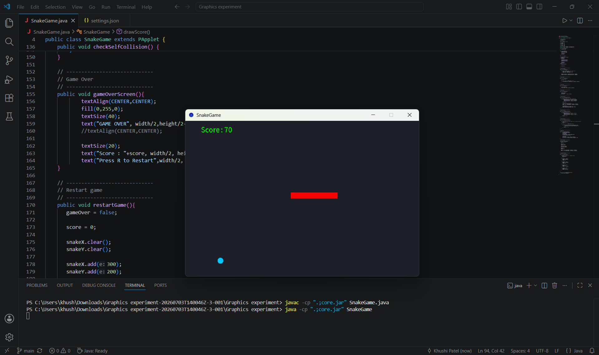
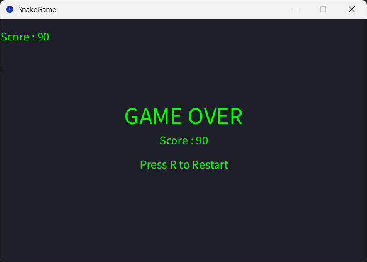
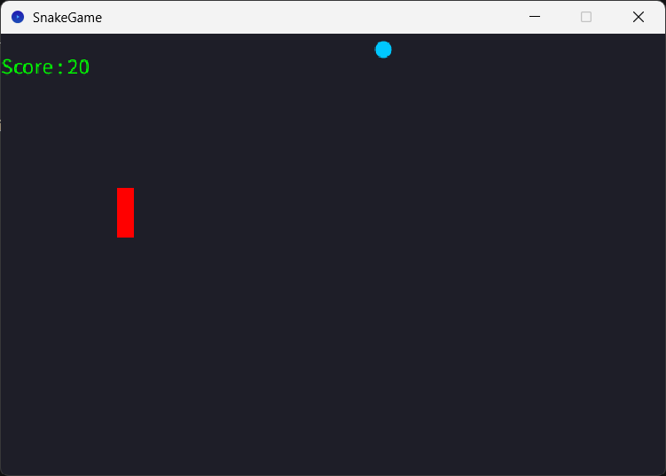

# 🐍 Snake Game in Java

A classic Snake Game built in **Java** using the **Processing (PApplet)** library.

This project was developed to strengthen my understanding of Java fundamentals, game development concepts, collision detection, and clean code practices through hands-on implementation.

---

## 🎮 Gameplay

### 🚀 Game Start



### 💀 Game Over



### 🔄 Restart Game



---

## ✨ Features

- 🎮 Snake movement using arrow keys
- 🍎 Random food generation
- 📈 Snake grows after eating food
- 🏆 Real-time score tracking
- 🚧 Wall collision detection
- 🐍 Self collision detection
- 💀 Game Over screen
- 🔄 Restart functionality using **R**
- 🧹 Clean and modular code structure

---

## 🛠️ Tech Stack

- Java
- Processing (PApplet)
- VS Code
- Git
- GitHub

---

## 📂 Project Structure

```text
Snake-Game-Java/
│
├── images/
│   ├── start-game.png
│   ├── game-over.png
│   └── restart-game.png
│
├── SnakeGame.java
├── core.jar
├── README.md
└── .gitignore
```

---

## 🎮 Controls

| Key | Action |
|------|--------|
| ⬆️ | Move Up |
| ⬇️ | Move Down |
| ⬅️ | Move Left |
| ➡️ | Move Right |
| **R** | Restart the Game |

---

## 🚀 How to Run

### Clone the repository

```bash
git clone https://github.com/Zeronity2/Snake-Game-Java.git
```

### Compile

```bash
javac -cp ".;core.jar" SnakeGame.java
```

### Run

```bash
java -cp ".;core.jar" SnakeGame
```

---

## 💡 About This Project

This Snake Game is one of my first Java projects and an important milestone in my programming journey. I built it feature by feature, focusing on understanding the logic behind each implementation rather than simply making it work.

Throughout this project, I learned about game loops, collision detection, state management, debugging, code organization, and using Git to track development through meaningful commits. It also strengthened my confidence in solving problems independently and building complete software projects from scratch.

---

## 📚 What I Learned

- Java game development fundamentals
- Processing (PApplet)
- Game loops
- Collision detection
- State management
- ArrayList usage
- Keyboard event handling
- Refactoring code into reusable methods
- Debugging and problem-solving
- Version control using Git and GitHub

---

## 🌱 Future Improvements

- 🥇 High Score System
- ⏸️ Pause Feature
- 🔊 Sound Effects
- 🎨 Better UI and Animations
- 🎯 Multiple Difficulty Levels

---

## 👩‍💻 Author

**Khushi Patel**

B.Tech Computer Science Student

GitHub: https://github.com/Zeronity2

---

⭐ If you found this project interesting, feel free to give it a star!
